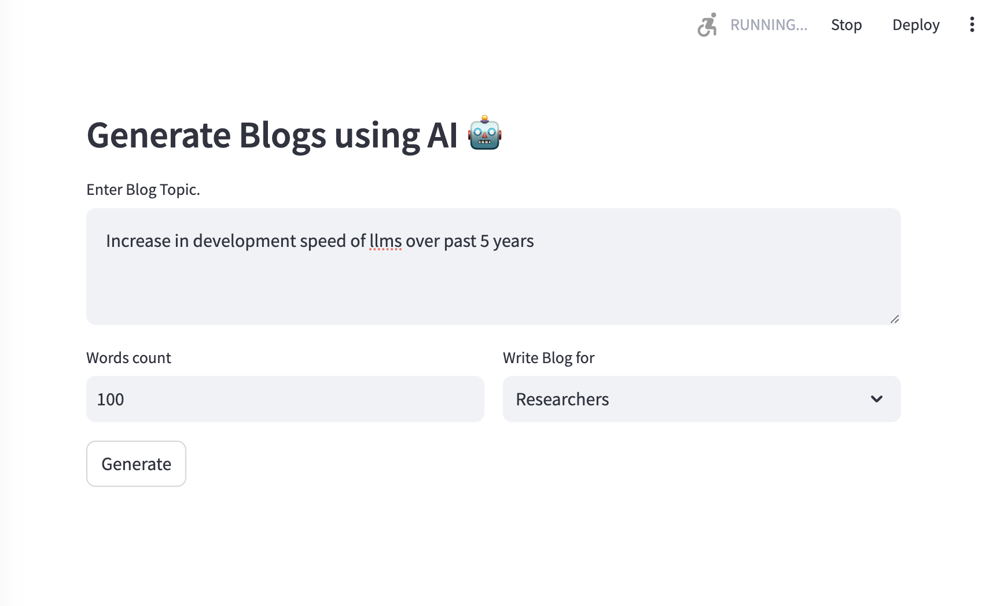

# LLMs and Fine-Tuning

Welcome to the **LLMs and Fine-Tuning** repository! This repo contains my journey of learning and experimenting with Large Language Models (LLMs) and fine-tuning techniques. All the apps and projects in this repository are built using resources from various online platforms, including YouTube tutorials, official documentation, and other community resources.

## 🚀 Overview

This repository contains code and resources related to:

- **Large Language Models (LLMs)**: Experimentation with LLM architectures like Transformers, GPT, BERT, LLaMA, etc.
- **Fine-Tuning**: Techniques to fine-tune pre-trained models to adapt them to specific tasks.
- **NLP Projects**: Practical implementations of chatbots, text generators, and other NLP applications using fine-tuned models.

## 📚 Learning Resources

The learning and code implementations in this repository are based on:

- **YouTube tutorials**: Various helpful videos covering LLMs, fine-tuning, and NLP applications.
- **Official Documentation**: Reference materials from frameworks such as OpenAI, Hugging Face, Meta AI (LLaMA), TensorFlow, and PyTorch.
- **Community Articles and Blogs**: Insights and techniques shared by the AI/ML community.

## 🛠️ Projects

### 1. **Blog Generator App with LLaMA2**

   - **Description**: An App LLaMA2 model to provide personalized responses for a specific domain in limit words as provided by user.
   - **Tech Stack**: Python, Meta AI’s LLaMA2, Streamlit, Langchain, Langchain-Community etc.
   - **Status**: Completed ✔️✔️✔️✔️✔️✔️✔️✔️

### 2. **Text Generator with GPT**
   - **Description**: A text generation app that creates coherent text given a prompt using a fine-tuned GPT model.
   - **Tech Stack**: Python, OpenAI API
   - **Status**: In Progress

### 3. **Sentiment Analysis with BERT**
   - **Description**: Fine-tuned BERT model for sentiment analysis on a custom dataset.
   - **Tech Stack**: Python, Hugging Face Transformers, TensorFlow
   - **Status**: In Progress
     
### 4. **Student Support Chatbot**
   - **Description**: A chatbot built using a pre-trained transformer model, fine-tuned to assist students with campus information and admissions queries.
   - **Tech Stack**: Python, Hugging Face Transformers, OpenAI API
   - **Status**: In Progress

... (more projects as we go forward)

## 🔧 Setup and Installation

To run the projects in this repository, follow these steps:

1. **Clone the repository**:
   ```bash
   git clone https://github.com/arpitpatelsitapur/llms-and-finetuning.git
   ```
2. **Navigate to the project directory**:
   ```bash
   cd llms-and-finetuning/project-name
   ```
3. **Install dependencies**:
   ```bash
   pip install -r requirements.txt
   ```

## 🌟 Contributing

Contributions are welcome! If you have any ideas, suggestions, or improvements, feel free to open an issue or submit a pull request.

---
